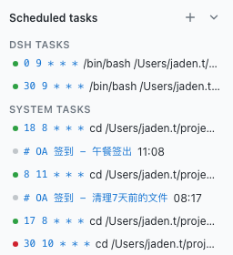
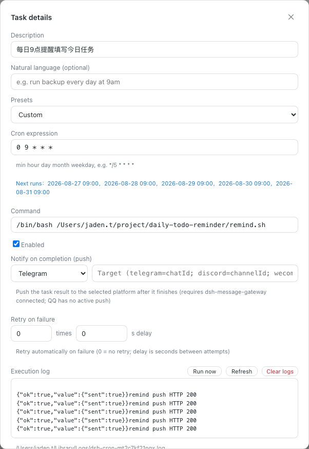

# dsh-cron-panel

[中文](README.md) · [English](README.en.md)

Un panel de tareas programadas para la GUI web de DSH: se sitúa entre el selector de workspace y los ajustes en la barra lateral, gestionando tareas de DSH y tareas del sistema (crontab) en secciones separadas, con creación por lenguaje natural, edición a pantalla completa y registros de ejecución.

## Características

- **Panel lateral**: debajo del selector de workspace y encima de los ajustes; ➕ en la cabecera para crear, ▾ para contraer (se pliega a una barra de título fina; el estado se guarda)
- **Secciones separadas e indicadores de estado**: las tareas de DSH y del sistema se muestran por separado, con puntos indicadores de estado (🟢 éxito / 🔴 error / ⚪ no ejecutado aún)
- **Registros de ejecución y limpieza en un clic**: las tareas registran automáticamente con actualización en vivo y botón para limpiar registros y evitar acumulación
- **Creación por lenguaje natural**: escribe «ejecutar copia cada día a las 9am», «limpiar temporales cada 30 minutos», «cada lunes a las 20h» y se parsea automáticamente a una expresión cron (chino e inglés, más de 17 patrones); también se admiten expresiones manuales
- **Detalles a pantalla completa**: haz clic en una tarea para abrir una superposición sobre la conversación, cierra con la ✕ arriba a la derecha; editar / guardar / eliminar / activar
- **Vista previa de la próxima ejecución**: al editar, se muestran automáticamente las próximas 5 ejecuciones a partir de la expresión cron (evita errores)
- **Notificar al finalizar**: al editar una tarea puede configurar "notificar al finalizar" — tras terminar, el resultado se envía a la plataforma seleccionada (Telegram / Discord / Bot de IA de WeCom / Email); requiere `dsh-message-gateway` instalado y conectado (QQ no admite push activo). El envío usa `/gateway/push`; al comando cron se le añade automáticamente el segmento de push (código de salida + descripción), sin configuración adicional
- **Ejecutar ahora**: en los detalles de la tarea, pulse "Ejecutar ahora" para ejecutar el comando una vez inmediatamente (sin programación cron) y ver el código de salida y la salida en tiempo real — verifique una tarea justo tras crearla en lugar de esperar su horario
- **Reintento automático**: configure el número de reintentos y la espera entre intentos (el comando corre en un subshell; un código de salida fallido dispara el reintento)
- **Copia de seguridad antes de escribir**: cada reescritura de crontab se antecede de una copia del contenido actual en `~/.local/share/dsh-cron-backups/` (conserva las 20 más recientes), de modo que los errores siempre se pueden revertir

- **Multilingüe**: sigue el idioma de la interfaz web de DSH (chino / inglés); los navegadores en español reciben automáticamente el texto en español; por defecto chino simplificado
- Tema claro / oscuro siguiendo la GUI web de DSH

## Capturas de pantalla

**Panel lateral** (secciones DSH / sistema + añadir + contraer):



**Detalles a pantalla completa** (formulario de edición + registro de ejecución, cerrar arriba a la derecha):



## Instalación

```sh
dsh plugin --profile web add dsh-cron-panel
```

Reinicia `dsh web` y el panel «Tareas programadas» aparece debajo del selector de workspace en la barra lateral.

> Para desarrollo local, instala mediante un enlace: `dsh plugin --profile web add link:/path/to/dsh-cron-panel`. Tras editar el código, ejecuta `npm run build` y actualiza la página para ver los cambios.

## Comentarios

¿Encontró un error o tiene una sugerencia? Abra un issue en [GitHub Issues](https://github.com/a792883583/dsh-cron-panel/issues) — sus comentarios nos ayudan a mejorar el plugin.

## Licencia

MIT
